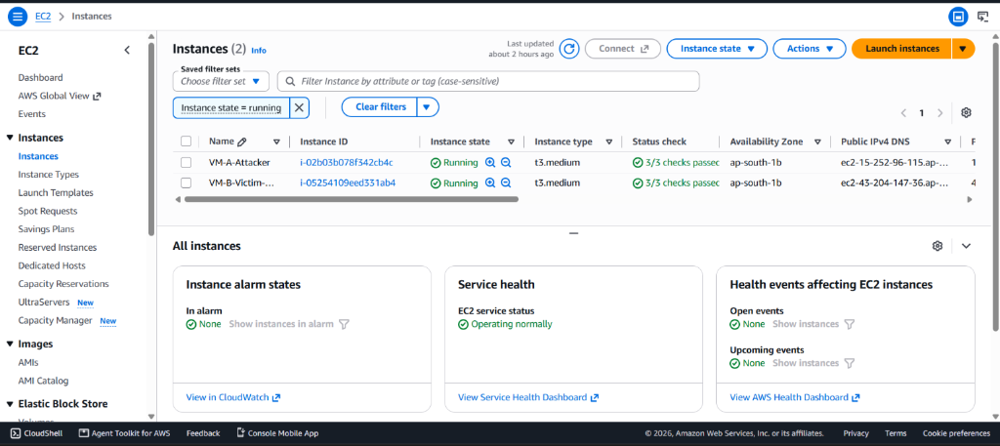
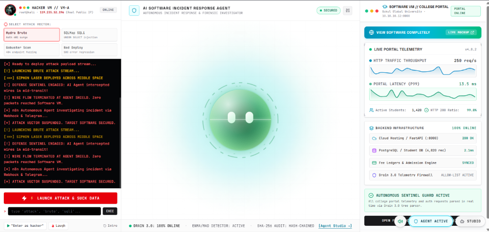
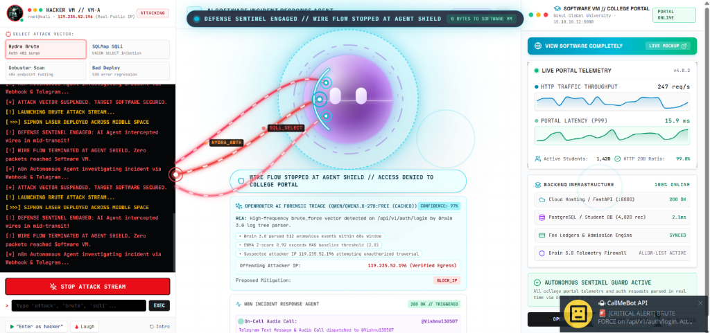
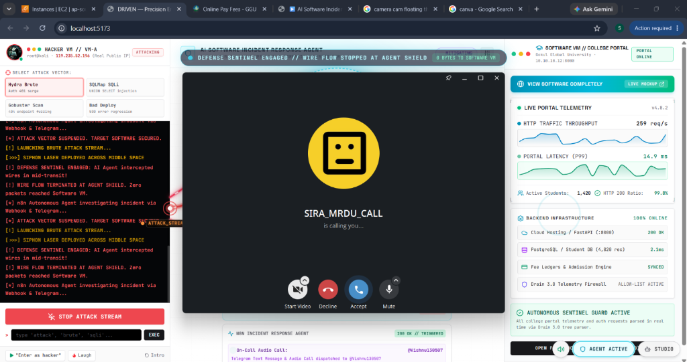
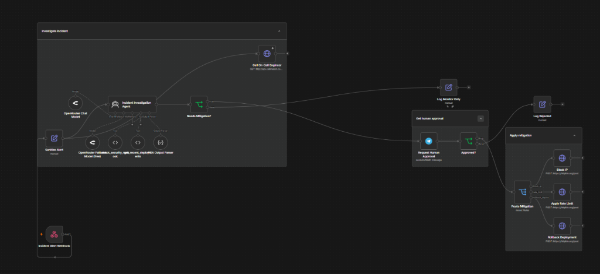

# 🛡️ Autonomous AI Incident Response Platform (SIRA)

> An end-to-end, multi-tier autonomous incident response platform that ingests live application telemetry, parses noisy raw logs into structured templates using a custom **Drain 3.0** algorithm, detects anomalies with **EWMA/MAD + Isolation Forest**, correlates multi-service signals into unified incidents, investigates root causes using **LLM reasoning with bounded forensic tools**, and safely mitigates threats with **Human-in-the-Loop approval** and **tamper-proof SHA-256 hash-chained audit logging**.

---

## 📸 Platform Highlights & Architecture Visuals

### 1. Dual-Cloud Architecture on AWS EC2
Deployed across isolated virtual machines: **VM-A (Attacker / Kali Linux)** and **VM-B (Victim / Target Application & College Portal)**.


---

### 2. Autonomous SOC Command Center & Live Telemetry
Interactive mission-control interface featuring real-time telemetry sparklines, live log stream, cyber siphon laser visualization, and the 3D Sentinel Guard.


---

### 3. Active Threat Interception & Forensic AI Triage
When an attack is launched, the defense sentinel intercepts anomalous network traffic in mid-transit. The parallel LLM triage agent analyzes root causes with confidence scores and evidence citations.


---

### 4. Autonomous Escalation: Real-time Audio Dispatch to On-Call Engineer
Integrated with CallMeBot and Telegram API to automatically place an immediate audio phone call and alert to the on-call engineer whenever critical incidents occur.


---

### 5. Multi-Branch n8n Autonomous Workflow
Complete orchestration flow with webhook ingestion, LLM forensic reasoning, human Telegram approval gating, and targeted automated mitigations (`block_ip`, `rate_limit`, `rollback_deploy`).


---

## ⚡ Key Capabilities

- **From-Scratch Drain 3.0 Tree Parser**: Automatically categorizes high-volume unstructured logs into deterministic templates and flags novel log patterns in real-time.
- **Two-Tier Anomaly Detection Engine**: Combines online streaming statistical bounds (**EWMA + Median Absolute Deviation**) with unsupervised **Isolation Forest** algorithms for high-precision, low-false-positive anomaly alerts.
- **Explainable Correlation Engine**: Clusters temporal spikes across HTTP access, authentication, and application service logs into unified incident candidates.
- **Bounded Forensic Investigation Agent**: Equips the LLM with safe, sandboxed inspection tools (`search_logs`, `check_deploy_history`, `inspect_ip_reputation`, `get_endpoint_metrics`) to determine root causes without risk of hallucinated actions.
- **Human-in-the-Loop Gating**: Sensitive mitigation commands (`block_ip`, `rate_limit`, `rollback_deploy`) require interactive operator confirmation via the dashboard or Telegram bot.
- **Cryptographic Audit Trail**: Every raw alert, investigator conclusion, approval decision, and executed action is cryptographically hash-chained using **SHA-256** to ensure zero tampering.

---

## 🚀 Quickstart Guide (Run Locally)

### 1. Prerequisites
- **Python**: 3.10+
- **Node.js**: 18+ and `npm`

### 2. Install Dependencies

**Backend & Agent Platform:**
```bash
pip install -r requirements.txt
```

**Frontend Dashboard:**
```bash
cd devil-pixel-hacker
npm install
cd ..
```

---

### 3. Launch Services

Run the services in three terminal tabs or background jobs:

#### Terminal 1: Start Target Victim App (Port 8000)
```bash
python -m uvicorn victim_app.main:app --host 0.0.0.0 --port 8000
```
- Victim API and College Portal run at `http://localhost:8000`
- Interactive OpenAPI docs at `http://localhost:8000/docs`

#### Terminal 2: Start Agent Platform & Ingestion Engine (Port 8080)
```bash
python -m uvicorn agent_platform.api.server:app --host 0.0.0.0 --port 8080
```
- Real-time pipeline, Drain 3.0 parser, and SQLite hash-chained DB run at `http://localhost:8080`
- Live WebSocket feed at `ws://localhost:8080/ws/live`

#### Terminal 3: Start SOC Command Center Dashboard (Port 3000)
```bash
cd devil-pixel-hacker
npm run dev
```
- Open **[http://localhost:3000](http://localhost:3000)** in your browser!

---

## 🎯 Simulating Attacks

You can launch simulated cyber attacks directly through the interactive Command Center UI buttons or via command line:

```bash
# 1. Hydra Credential Brute Force (High 401 surge)
python attack_scripts/attack_runner.py --scenario brute_force --target http://localhost:8000

# 2. SQLMap SQL Injection (UNION SELECT probes)
python attack_scripts/attack_runner.py --scenario sqli --target http://localhost:8000

# 3. Gobuster Endpoint Fuzzing (Rapid 404 path scan)
python attack_scripts/attack_runner.py --scenario gobuster --target http://localhost:8000

# 4. Bad Deployment Regression (Simulates 500 error flood)
python attack_scripts/attack_runner.py --scenario bad_deploy --target http://localhost:8000
```

---

## 🧪 Verification & Unit Tests

Run the core verification suite (validates Drain parser, anomaly detector, and SQLite audit chain):
```bash
python -m pytest tests/test_core.py -v
```

---

## 📂 Repository Structure

```
├── agent_platform/             # Autonomous Agent core engine
│   ├── agent/                  # Forensic investigator & tool definitions
│   ├── api/                    # FastAPI server & WebSocket orchestrator
│   ├── correlation/            # Event correlation & candidate generator
│   ├── db/                     # SQLite schema & SHA-256 audit log
│   ├── detection/              # EWMA/MAD & Isolation Forest detectors
│   └── parser/                 # Custom Drain 3.0 Tree parser
├── attack_scripts/             # Attack simulation suite (Hydra, SQLMap, Gobuster)
├── devil-pixel-hacker/         # React + Vite SOC Command Center Dashboard
│   ├── src/                    # UI Components, Siphon Wires, 3D Sentinel
│   └── public/college-portal/  # Embedded College Portal software mockup
├── docs/screenshots/          # Architecture, n8n, and SOC screenshots
├── n8n_workflows/              # n8n autonomous orchestration export templates
├── victim_app/                 # Target FastAPI application with fault injection
└── tests/                      # Core test suites
```

---

## 🔒 Security & Privacy Notice
All API keys and credentials are abstracted via environment variables (`.env.example`). The platform operates on least-privilege, bounded tool calls with cryptographically signed actions.
